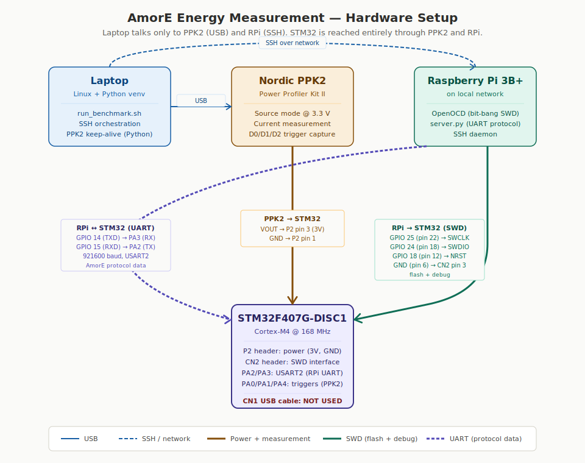
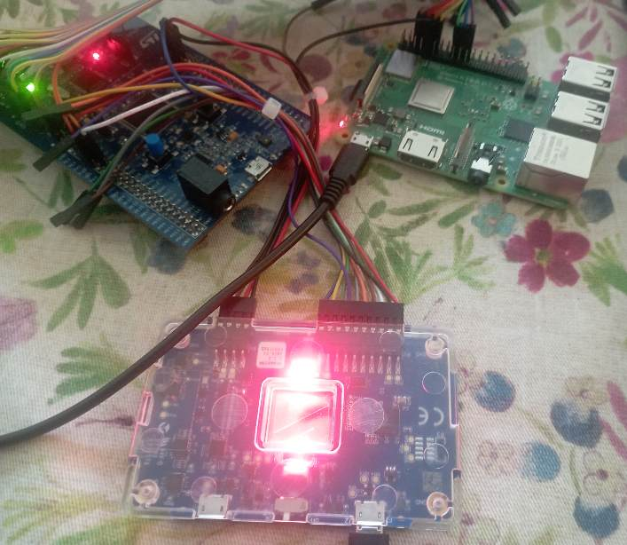

# AmorE — Results Summary (BN254 & BLS12-381 on Cortex-M4)

AmorE (Amortized Remote Pairing Evaluation) lets a constrained Cortex-M4 client
(STM32F407 @ 168 MHz) delegate expensive bilinear pairings to an untrusted
remote server (Raspberry Pi 3B) and verify the returned result cheaply,
rejecting a cheating server with probability ≈ 1; it is a *public-input*
protocol, so the security property is verifiability of the server's answer, not
input secrecy. This work ports AmorE across two pairing-friendly curves —
**BN254** (BN128) and **BLS12-381** — in pure C with no assembly, and measures
three things on real hardware: **energy, time, and memory**. The point of AmorE
here is not to beat a local pairing on speed or energy for a single computation;
it is to enable *verifiable pairing delegation with a tiny client footprint*, so
pairing-based cryptography can run on parts where a full pairing library does not
fit. Both ports passed full validation: **61/61 honest rounds verified, 1/1
malicious round rejected, status `0x600D0000`** on each curve.

> This summary combines three documents: the **BN254 benchmark report**, the
> **BLS12-381 benchmark report**, and the **2026-05-31 Energy Study**. Every
> figure below is reproduced from one of those three sources — nothing is
> invented — and each result is labelled with its provenance
> (MEASURED / DERIVED / PROJECTED).

---

## 0. Hardware setup

**Architecture** — STM32F407 client, Raspberry Pi 3B server, and the Nordic
PPK2 used for energy measurement:

**Physical setup** — the actual bench: Raspberry Pi 3B, STM32 board, and the
Nordic PPK2:

---

## 1. Energy results

Source: **Energy Study (2026-05-31)** — measured with a Nordic **PPK2** at
3.300 V (uncalibrated; no reference resistor — absolute mA/mJ are
indicative only, ratios are calibration-independent). AmorE and RELIC both built `-O3`,
`ARITH=easy` (pure C, no assembly), phase-aware **compute-only** (current
measured during the GPIO-bit0 compute phase, not the busy-wait).

### 1a. Batch delegation (M = 50) — the headline

AmorE is built to delegate *many* pairings. Delegating 50:

| Curve      | 50× local pairing | AmorE batch(50) | AmorE saves        |
|------------|-------------------|-----------------|--------------------|
| BN254      | 4,262 mJ          | 2,669 mJ        | **37%** (1,593 mJ) |
| BLS12-381  | 8,998 mJ          | 3,880 mJ        | **57%** (5,117 mJ) |

Provenance: cycles **MEASURED** (microbench `g_micro`, DWT, min-of-16); batch
client cost **DERIVED** (paper Table-1 formula; batch not yet implemented on
RELIC); energy **PROJECTED** (derived cycles × measured pairing current ×
3.3 V). Compute-only; this is not an end-to-end measurement (end-to-end batch is
future work).

### 1b. Single delegation (M = 1, hand-written Fp12) — least favorable

A *different*, worst-case quantity — one pairing, home code, not batch:

| Curve      | AmorE / round | 1× RELIC pairing | Ratio      |
|------------|---------------|------------------|------------|
| BN254      | 160.16 mJ     | 85.27 mJ         | 1.88× more |
| BLS12-381  | 354.04 mJ     | 180.42 mJ        | 1.96× more |

**These two blocks do not conflict.** Batch (1a) is the intended use and wins;
single (1b) is the worst case and loses. The ~1.9× single-case cost is largely
hand-written-Fp12 implementation debt, not a protocol limit.

---

## 2. Timing results

Per-round / single times from the **Energy Study, Mode A/B (`-O3`)**; the batch
figures are from the BN254 / BLS12-381 reports.

### 2a. Batch delegation (M = 50) — client compute time per pairing

From the paper's cost formula applied to measured RELIC-grade primitives (same
batch regime as the energy headline; positive = AmorE saves time):

| Curve      | AmorE vs 1 local pairing (batch M=50)                  |
|------------|--------------------------------------------------------|
| BN254      | **+37%** — AmorE saves 37% of compute time per pairing |
| BLS12-381  | **+57%** — AmorE saves 57% of compute time per pairing |

Cycles MEASURED (microbench); batch client cost DERIVED (paper formula);
compute-only.

### 2b. Per-round / single delegation (measured)

| Curve      | 1 RELIC pairing (Mode B)    | AmorE per round, N=50 (Mode A)  | Ratio        |
|------------|-----------------------------|----------------------------------|--------------|
| BN254      | 218.92 ms (36,778,389 cyc)  | 421.5 ms (70,813,093 cyc)        | 1.92× slower |
| BLS12-381  | 523.41 ms (87,932,879 cyc)  | 901.0 ms (151,357,860 cyc)       | 1.72× slower |

One delegation, hand-written Fp12. The "slower" ratio here and the "saves"
figure in 2a are **different quantities** — single pairing vs a batch of 50 —
not a contradiction.

---

## 3. Memory results

Sources: BN254 report (§2 / §11), BLS12-381 report (Finding 2 / §2). The AmorE
client carries **no pairing library**, so its footprint is small.

**AmorE client footprint — BN254**

| Item                         | Size                  |
|------------------------------|-----------------------|
| Flash total                  | 20.0 KiB (1.96% of 1 MB) |
| SRAM working (.data + .bss)  | 3.2 KiB               |
| SRAM incl. 32 KiB stack/heap | 35.2 KiB              |

**AmorE client footprint — BLS12-381**

| Item                       | Size                       |
|----------------------------|----------------------------|
| Code (.text)               | 15.5 KiB (1.48% of 1 MB)   |
| Zero-init (.bss, Fp12 work)| 35.0 KiB (17.85% of 192 KiB) |
| Max stack frame            | 388 B                      |

**vs a full local pairing library** (RELIC, BN254, measured on the same MCU —
BN254 report §11.2):

| Resource                              | AmorE vs RELIC   |
|---------------------------------------|------------------|
| Flash (code + rodata)                 | **4.2× lighter** |
| SRAM working (.data + .bss)           | **21× lighter**  |
| SRAM total (incl. 32 KiB stack/heap)  | **2.8× lighter** |

The headline: AmorE needs no Fp12 pairing library on the client, which is why it
fits where RELIC cannot (e.g. STM32L0 / G0 with 4–32 KiB SRAM).

---

## Bottom line

For a single pairing on a Cortex-M4 that can already fit RELIC, AmorE costs
~1.7–1.9× the time and ~1.9× the energy of computing locally. AmorE wins in the
**batch** regime (M=50: **37%** energy saved on BN254, **57%** on BLS12-381 —
derived) and, above all, on **footprint + verifiable outsourcing**: up to
~4–21× lighter memory and no pairing library on the client. Both ports passed
full validation (61/61 honest, 1/1 malicious rejected).

---

*Provenance.* Energy and per-round timing are from the 2026-05-31 Energy Study
(Nordic PPK2 at 3.300 V, uncalibrated — no reference resistor; absolute
values indicative only, ratios calibration-independent; `-O3`, pure-C, phase-aware compute-only).
Batch (M=50) figures are derived from
the paper's cost formula on measured RELIC-grade primitives — not an end-to-end
measurement. Memory and correctness are from the per-curve benchmark reports. No
figure in this summary was invented; each is reproduced from one of the three
source documents.
